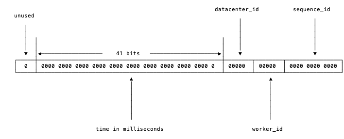

# Chapter 2

## Shell Commands

### Man cd

cd cannot directly manned because it is a shell built-in command, but with

```bash
man builtins
```

We can get cd manual entry:

```
       cd [-L|[-P [-e]] [-@]] [dir]
              Change the current directory to dir.  if dir is not supplied, the value of the HOME shell variable is the default.  Any additional arguments following dir are ignored.  The variable CDPATH defines the search path for the  directory
              containing dir: each directory name in CDPATH is searched for dir.  Alternative directory names in CDPATH are separated by a colon (:).  A null directory name in CDPATH is the same as the current directory, i.e., ``.''.  If dir be‐
              gins with a slash (/), then CDPATH is not used.  The -P option causes cd to use the physical directory structure by resolving symbolic links while traversing dir and before processing instances of .. in dir (see also the -P  option
              to  the  set  builtin  command); the -L option forces symbolic links to be followed by resolving the link after processing instances of .. in dir.  If .. appears in dir, it is processed by removing the immediately previous pathname
              component from dir, back to a slash or the beginning of dir.  If the -e option is supplied with -P, and the current working directory cannot be successfully determined after a successful directory change, cd will return  an  unsuc‐
              cessful  status.  On systems that support it, the -@ option presents the extended attributes associated with a file as a directory.  An argument of - is converted to $OLDPWD before the directory change is attempted.  If a non-empty
              directory name from CDPATH is used, or if - is the first argument, and the directory change is successful, the absolute pathname of the new working directory is written to the standard output.  The return value is true if  the  di‐
              rectory was successfully changed; false otherwise.
```

究其根本原因，`当前目录`对于每个进程都是独立的属性，如果cd作为被shell spawn的进程，则必然无法改变shell本身的路径

### WC

`wc`(word count)

```
NAME
       wc - print newline, word, and byte counts for each file

SYNOPSIS
       wc [OPTION]... [FILE]...

DESCRIPTION
       Print newline, word, and byte counts for each FILE, and a total line if more than one FILE is specified.  A word is a non-zero-length sequence of characters delimited by white space.

       With no FILE, or when FILE is -, read standard input.

       The options below may be used to select which counts are printed, always in the following order: newline, word, character, byte, maximum line length.

       -c, --bytes
              print the byte counts

       -m, --chars
              print the character counts

       -l, --lines
              print the newline counts

       --files0-from=F
              read input from the files specified by NUL-terminated names in file F; If F is - then read names from standard input

       -L, --max-line-length
              print the maximum display width

       -w, --words
              print the word counts
```

## Git

1. `git cherry-pick`

该操作可以使任意分支上的任意多commits应用到当前分支

当代码冲突时，有以下措施：

- `continue`:用户合并冲突后继续
- `abort`:退回到应用前
- `quit`:合并冲突后不再继续

2. `git rebase`

使用较少但是比较重要

由rebase本意得到的根本作用：变基

当master分支被更新，`git rebase`将从原始commit分支出的feature分支commit先被取消，然后应用到master分支更新后的commit上，feature分支可看作由后commit引发得到的

若变基应用于同一分支，则可以使多个commit合并

3. 对于已经同步到远程的commits，不可能使用本地rebase来合并远程commit或修改顺序

## Go

go env中`GOARCH`表示目标处理器架构，`GOBIN`表示编译器和链接器的安装位置，`GOOS`表示目标操作系统，`GOPATH`表示当前工作目录，`GOROOT`表示Go开发包的安装目录。

### 数据类型

`int`为64位，可指定数据宽度
`byte` = `uint8`，宽度最小
`rune` = `int32`
`uintptr`
无`double`，为`float64`
`complex64`实数虚数
`complex128`实数虚数

### 语言定义

`{`不能位于单独的行

#### 符号定义

##### 变量定义

- `var id+ [\[size\]*] type [= initVal+]`
- `var id+ = [\[size\] type]initVal+` 自行判断type
- `id+ := [\[size\] type]initVal+`

**数组**

```
id := [size]* type {
    
}
```

数组初始化还可以类似map的方式：`{index: value}`，可以与顺序赋值混合使用：

```
var id = [...]type {vals...}
```

数组的size在声明时可以为0，任意一维为0，则整个数组内存占用为0，于是可以有以下操作：

```go
var times [5][0]int
for range times {
       fmt.Println("hello")
}
```

为range次数做法；

```go
    c1 := make(chan [0]int)
    go func() {
        fmt.Println("c1")
        c1 <- [0]int{}
    }()
    <-c1
```

为管道同步操作

结构体数组key为结构体域

可以用`fmt.Printf`函数提供的`%T`或`%#v`谓词语法来打印数组的类型和详细信息

数组长度`len(arr)`，Go语言实现中非0大小数组的长度不得超过 2GB

**字符串**

源码：UTF-8编码，`rune`序列，但也可以通过byte访问

字符串相当于

```
data := "abc"
var data = [...]byte{
       [charString...] // 'a'
}
```

可使用切片，`len`

字符串中可以使用"\x[num][num]"表示UTF-8字符，损坏的UTF-8字符被转换为`\uFFFD`，菱形问号错误符，但是正确字符仍然能够被正常访问到

**切片**

打印切片`%v, %+v, %#v`

声明指针在type前加*，空指针为`nil`

无size时为切片定义，其他定义方式：

- `var id []type` 不定义长度
- `var id []type = make([]type, len)` 定义长度
- `var id []type = make([]type, len, capacity)` 定义长度，容量

初始化右值：

- `[]type {num...}`
- `arr[start:end]`左闭右开，arr也有可能是切片，缺省值时为`0`与`len(arr)`
- `arr[start:end:capacity]`

- `len(slice)`获取长度
- `cap(slice)`获取容量

数组或切片作函数参数时可省略长度信息，空切片为`nil`

`append(slicel, num...)`尾部添加元素，添加其他切片所有元素`append(slice, []int{nums}...)`
`copy(slice1, slice2)`拷贝切片内容到`slice1`头部，但是并不改变`slice1`大小

在中间插入元素x：

```go
a = append(a, 0)     // 切片扩展 1 个空间
copy(a[i+1:], a[i:]) // a[i:] 向后移动 1 个位置
a[i] = x             // 设置新添加的元素
```

在中间插入切片x：

```go
a = append(a, x...)       // 为 x 切片扩展足够的空间
copy(a[i+len(x):], a[i:]) // a[i:] 向后移动 len(x) 个位置
copy(a[i:], x)            // 复制新添加的切片
```

使用切片更方便地删除元素

```go
a = []int{1, 2, 3}
a = a[:len(a)-1]   // 删除尾部 1 个元素
a = a[:len(a)-N]   // 删除尾部 N 个元素
a = a[1:] // 删除开头 1 个元素
a = a[N:] // 删除开头 N 个元素
a = append(a[:0], a[1:]...) // 删除开头 1 个元素
a = append(a[:0], a[N:]...) // 删除开头 N 个元素
a = a[:copy(a, a[1:])] // 删除开头 1 个元素
a = a[:copy(a, a[N:])] // 删除开头 N 个元素
a = append(a[:i], a[i+1:]...) // 删除中间 1 个元素
a = append(a[:i], a[i+N:]...) // 删除中间 N 个元素
a = a[:i+copy(a[i:], a[i+1:])]  // 删除中间 1 个元素
a = a[:i+copy(a[i:], a[i+N:])]  // 删除中间 N 个元素
```

在判断一个切片是否为空时，一般通过`len`获取切片的长度来判断，一般很少将切片和`nil`值做直接的比较

零长切片初始化后方便插入形成新切片

切片操作并不会复制底层的数据，因此只引用一小部分数据时会造成整个数组活跃而不被内存回收，因此可以采用复制操作规避损失`append([]byte{}, rawSlice...)`

删除操作时也有可能待删元素被引用，正确方式：

```go
var a []*int{ ... }
a[len(a)-1] = nil // GC 回收最后一个元素内存
a = a[:len(a)-1]  // 从切片删除最后一个元素
```

[]float64 类型的切片转换为 []int 类型的切片：

IEEE754浮点使得浮点数大小可以按照整型(64位)排序

**map**

map作为type时格式：`map[type]type`，声明也可使用

`id := make(map[type]type)`

加入元素为：

`id[key] = value`

删除元素：

`delete(id, key)`

可以进行类型转换，格式：`typeName(expr)`

对于基础类型不支持隐式类型转换

解包操作符：`...`，将切片解析为各个元素

##### 常量定义

常量定义将变量定义`var`改为`const`

`iota`:被编译器修改的常量，在每次const出现时归0，内部使用时按行从0累加（即使该行未使用）：

```go
const (
    a = iota
    b = iota
    c = iota
)

// => simplified

const (
    a = iota
    b
    c
)
```

##### 结构体定义

```
type structName struct {
    varName type
}
```

type作用类似C的`typedef`

##### 接口定义

```
type interfaceName interface {
       funcioneName(paramDef) (?[returnTypes...])?
}
```

定义相同类型函数后使用：

```
var id = interfaceName
id = new(implementFunctionName)

var (
       id interfaceName = implementFunctionName // 支持显示或隐式类型转换
)
```

#### channel

共享内存(array)

声明：

```go
ch := make(chan int, bufferSize)
```

关闭通道：`close(ch)`

遍历通道使用range，在通道未能产生新的数时阻塞，通道被关闭时结束遍历操作

```go
ch <- v    // Send v to channel ch.
v := <-ch  // Receive from ch, and
           // assign value to v.
```

- 无缓存的 Channel 上的发送操作总在对应的接收操作完成前发生，否则死锁；
- 对于从无缓冲 Channel 进行的接收，发生在对该 Channel 进行的发送完成之前。
- 对于带缓冲的Channel，对于 Channel 的第 K 个接收完成操作发生在第 K+C 个发送操作完成之前，其中 C 是 Channel 的缓存大小
- 对于从无缓冲 Channel 进行的接收，发生在对该 Channel 进行的发送完成之前

#### 分支

`switch`用于一个变量的多分枝判断选择，每次只能有一个条件成立

`select`不指定变量，`case`为条件语句，每次可能会有多个语句成立，`select`将会随机挑选执行，也可能没有语句成立，则会阻塞直到某分支能够执行

#### 循环

格式：

- `for init; condition; post { }`
- `for condition { }`
- `for { }`
- `for key := range array { }`
- `for key, value := range array { }`
- `for _, value := range array { }`

#### 函数

`func funcName(varName type? [, varName type]) (?[[returnName]? returnType...]`)?

函数定义是参数相同类型的可以放在一起，在最后加`type`，支持多个返回值，多个返回值加`()`

go显然支持了C的函数指针，因此支持回调函数

可变数量的参数其实是一个切片类型的参数

切片中的底层数组部分是通过隐式指针传递(指针本身依然是传值的，但是指针指向的却是同一份的数据)，所以被调用函数是可以通过指针修改掉调用参数切片中的数据，但是len和cap是传值的，无法修改调用者信息。因此通过返回修改后的切片来更新之前的切片。这也是为何内置的 append 必须要返回一个切片的原因。

go在递归调用深度上无限制，Go 语言运行时会根据需要动态地调整函数栈的大小，32 位体系结构为 250MB，64 位体系结构为 1GB）

- <Go1.4，动态栈采用分段式，采用一个链表来实现动态栈，每个链表的节点内存位置不会发生变化。但是链表实现的动态栈对某些导致跨越链表不同节点的热点调用的性能影响较大，因为相邻的链表节点它们在内存位置一般不是相邻的，增加 CPU 高速缓存命中失败的几率
- >=Go1.4 改用连续的动态栈实现，也就是采用一个类似动态数组的结构来表示栈，问题：当连续栈动态增长时，需要将之前的数据移动到新的内存空间，这会导致之前栈中全部变量的地址发生变化

虽然 Go 语言运行时会自动更新引用了地址变化的栈变量的指针，但最重要的一点是要明白 Go 语言中指针不再是固定不变的了

不用关心 Go 语言中函数栈和堆的问题，编译器和运行时会帮我们搞定；同样不要假设变量在内存中的位置是固定不变的，指针随时可能会变化，特别是在你不期望它变化的时候。

##### 函数定义

函数返回值也可以命名

在函数内也可进行嵌套的函数定义，复制给某个变量

defer语句

defer 语句延迟执行了一个匿名函数，因为这个匿名函数捕获了外部函数的局部变量 v，这种函数我们一般叫闭包。闭包对捕获的外部变量并不是传值方式访问，而是以引用的方式访问。

`defer funcDef (param)`

panic 能够改变程序的控制流，调用 panic 后会立刻停止执行当前函数的剩余代码，并在当前 Goroutine 中递归执行调用方的 defer；

recover 可以中止 panic 造成的程序崩溃。它是一个只能在 defer 中发挥作用的函数，在其他作用域中调用不会发挥作用；

- panic 只会触发当前 Goroutine 的 defer；
- recover 只有在 defer 中调用才会生效；
- panic 允许在 defer 中嵌套多次调用，多次调用 panic 也不会影响 defer 函数的正常执行；

```go
type _panic struct {
	argp      unsafe.Pointer           // pointer to defer argument
	arg       interface{}              // pointer to panic argument
	link      *_panic                  // link to runtime._panic
	recovered bool                     // whether current panic recovered
	aborted   bool                     // whether current panic aborted
       // recover runtime.Goexit, only exit current goroutine without influence others
	pc        uintptr
	sp        unsafe.Pointer
	goexit    bool
}
```

嵌套调用的panic通过链表组织

go panic流程：

1. 创建新的 runtime._panic 并添加到所在 Goroutine 的 _panic 链表的最前面；
2. 在循环中不断从当前 Goroutine 的 _defer 中链表获取 runtime._defer 并调用 runtime.reflectcall 运行延迟调用函数；
3. 调用 runtime.fatalpanic 中止整个程序；

go recover流程：

如果当前 Goroutine 没有调用 panic，那么该函数会直接返回 nil，这也是崩溃恢复在非 defer 中调用会失效的原因。

在正常情况下，它会修改 runtime._panic 的 recovered 字段，runtime.gorecover 函数中并不包含恢复程序的逻辑，程序的恢复是由 runtime.gopanic 函数负责

##### 函数参数

函数可以作为另一个函数的参数，参数名后类型为函数形式

##### 函数闭包

函数返回值定义为匿名函数，返回后可直接使用，且栈帧位置一致，多次调用操作同一函数空间

```go
package main

import "fmt"

func getSequence() func() int {
   i:=0
   return func() int {
      i+=1
     return i  
   }
}

func main(){
   /* nextNumber 为一个函数，函数 i 为 0 */
   nextNumber := getSequence()  

   /* 调用 nextNumber 函数，i 变量自增 1 并返回 */
   fmt.Println(nextNumber())
   fmt.Println(nextNumber())
   fmt.Println(nextNumber())
   
   /* 创建新的函数 nextNumber1，并查看结果 */
   nextNumber1 := getSequence()  
   fmt.Println(nextNumber1())
   fmt.Println(nextNumber1())
}

/* output
1
2
3
1
2
 */
```

##### 函数作为结构体方法

结构体可以定义有关方法：

```go
func (varName structName) funcName ...
```

若对结构体域有更改，需要使用指针：

```go
func (varName *structName) funcName ...
```

对于给定的类型，每个方法的名字必须是唯一的，同时方法和函数一样也不支持重载。

继承：

```go
import "image/color"

type Point struct{ X, Y float64 }

type ColoredPoint struct {
    Point
    Color color.RGBA
}
var cp ColoredPoint
cp.X = 1
fmt.Println(cp.Point.X) // "1"
cp.Point.Y = 2
fmt.Println(cp.Y)       // "2"
```

通过嵌入匿名的成员，我们不仅可以继承匿名成员的内部成员，而且可以继承匿名成员类型所对应的方法。我们一般会将 Point 看作基类，把 ColoredPoint 看作是它的继承类或子类。

不过这种方式继承的方法并不能实现 C++ 中虚函数的多态特性。所有继承来的方法的接收者参数依然是那个匿名成员本身，而不是当前的变量。编译期进行展开

如果一个类型实现了一个 interface 中所有方法，我们说类型实现了该 interface，interface 变量存储的是实现者的值，这里是类似面向接口的做法，定义接口，用结构去实现接口，被调用函数调用接口，调用函数传入结构，动态绑定，向上转型。

```go
s := S{}      // S is struct
var i I //声明 i     // I is interface
i = &s //赋值 s 到 i
fmt.Println(i.Get())
```

区分 interface 的变量究竟存储哪种类型的值，`value, ok := em.(T)`：em 是 interface 类型的变量，T代表要断言的类型，value 是 interface 变量存储的值，ok 是 bool 类型表示是否为该断言的类型 T。

ok 是 true 表明 i 存储的是 *S 类型的值，false 则不是，类型断言(Type assertions)

如果需要区分多种类型，可以使用 switch 断言：

```go
switch t := i.(type) {
case *S:
    fmt.Println("i store *S", t)
case *R:
    fmt.Println("i store *R", t)
}
```

go 可以把指针进行隐式转换得到 value，但反过来则不行。

### range

应用于`array, slice, map, channel`

### go

并发，开启新线程执行函数

Go 语言是基于消息并发模型的集大成者，它将基于 CSP 模型的并发编程内置到了语言中，通过一个 go 关键字就可以轻易地启动一个 Goroutine，与 Erlang 不同的是 Go 语言的 Goroutine 之间是共享内存的。

Goroutine是 Go 语言特有的并发体，是一种轻量级的线程，与系统级线程不同的是启动大小可以很小(2KB/4KB)，而后会动态伸缩大小

`sync`包提供原子操作库

#### 并发helloworld

```go
func main() {
    var mu sync.Mutex

    mu.Lock()
    go func(){
        fmt.Println("你好, 世界")
        mu.Unlock()
    }()

    mu.Lock()
}
```

对于从无缓冲 Channel 进行的接收，发生在对该 Channel 进行的发送完成之前。有缓冲则相反，对于 Channel 的第 K 个接收完成操作发生在第 K+C 个发送操作完成之前

```go
func main() {
    done := make(chan int)

    go func(){
        fmt.Println("你好, 世界")
        <-done
    }()

    done <- 1
}

func main() {
    done := make(chan int, 1) // 带缓存的管道

    go func(){
        fmt.Println("你好, 世界")
        done <- 1
    }()

    <-done
}

func main() {
    done := make(chan int, 10) // 带 10 个缓存

    // 开 N 个后台打印线程
    for i := 0; i < cap(done); i++ {
        go func(){
            fmt.Println("你好, 世界")
            done <- 1
        }()
    }

    // 等待 N 个后台线程完成
    for i := 0; i < cap(done); i++ {
        <-done
    }
}

func main() {
    var wg sync.WaitGroup

    // 开 N 个后台打印线程
    for i := 0; i < 10; i++ {
        wg.Add(1)

        go func() {
            fmt.Println("你好, 世界")
            wg.Done()
        }()
    }

    // 等待 N 个后台线程完成
    wg.Wait()
}
```

#### 生产者消费者模型

通过channel可简单实现

```go
// 生产者: 生成 factor 整数倍的序列
func Producer(factor int, out chan<- int) {
    for i := 0; ; i++ {
        out <- i*factor
    }
}

// 消费者
func Consumer(in <-chan int) {
    for v := range in {
        fmt.Println(v)
    }
}
func main() {
    ch := make(chan int, 64) // 成果队列

    go Producer(3, ch) // 生成 3 的倍数的序列
    go Producer(5, ch) // 生成 5 的倍数的序列
    go Consumer(ch)    // 消费生成的队列

    // 运行一定时间后退出
    time.Sleep(5 * time.Second)
}
```

#### 发布订阅模型(pub/sub)

多个channel，视为主题，发布者发布主题，建立管道和订阅者通信，单个主题是生产者/消费者模型

#### 并发的安全退出

基于 select 实现的管道的超时判断：

```go
select {
case v := <-in:
    fmt.Println(v)
case <-time.After(time.Second):
    return // 超时
}
```

通过 select 的 default 分支实现非阻塞的管道发送或接收操作：

```go
select {
case v := <-in:
    fmt.Println(v)
default:
    // 没有数据
}
```

通过 select 来阻止 main 函数退出：

```go
func main() {
    // do some thins
    select{}
}
```

通过 select 和 default 分支可以很容易实现一个 Goroutine 的退出控制:

```go
func worker(cancel chan bool) {
    for {
        select {
        default:
            fmt.Println("hello")
            // 正常工作
        case <-cancel:
            // 退出
        }
    }
}

func main() {
    cancel := make(chan bool)
    go worker(cancel)

    time.Sleep(time.Second)
    cancel <- true
}
```

多个Goroutine，通过`close(cancel)`实现广播，所有从关闭管道接收的操作均会收到一个零值和一个可选的失败标志。但是`main`此时没有等待各个Goroutine回收清理工作完成即退出，改进：

```go
func main() {
    cancel := make(chan bool)

    var wg sync.WaitGroup
    for i := 0; i < 10; i++ {
        wg.Add(1)
        go worker(&wg, cancel)
    }

    time.Sleep(time.Second)
    close(cancel)
    wg.Wait()
}
```

使用context包：

```go
func worker(ctx context.Context, wg *sync.WaitGroup) error {
    defer wg.Done()

    for {
        select {
        default:
            fmt.Println("hello")
        case <-ctx.Done():
            return ctx.Err()
        }
    }
}

func main() {
    ctx, cancel := context.WithTimeout(context.Background(), 10*time.Second)

    var wg sync.WaitGroup
    for i := 0; i < 10; i++ {
        wg.Add(1)
        go worker(ctx, &wg)
    }

    time.Sleep(time.Second)
    cancel()

    wg.Wait()
}
```

#### Web开发

```go
// hello world
//brief_intro/echo.go
package main

import (
	"io/ioutil"
	"log"
	"net/http"
)

func echo(wr http.ResponseWriter, r *http.Request) {
	msg, err := ioutil.ReadAll(r.Body)
	if err != nil {
		wr.Write([]byte("echo error"))
		return
	}
	msg = []byte("hello world")
	writeLen, err := wr.Write(msg)
	if err != nil || writeLen != len(msg) {
		log.Println(err, "write len:", writeLen)
	}
}

func main() {
	http.HandleFunc("/", echo)
	err := http.ListenAndServe(":5678", nil)
	if err != nil {
		log.Fatal(err)
	}
}
```

##### 中间件

剥离非业务逻辑

#### 分布式

##### id生成分发

Snowflake算法



sequence_id循环自增

这样的机制可以支持我们在同一台机器上，同一毫秒内产生$2 ^ 12 = 4096$条消息，支持我们每数据中心部署 32 台机器，所有数据中心共 1024 台实例。表示 timestamp 的 41 位，可以支持我们使用 69 年

##### 分布式锁

进程内锁：

```go
import "sync"

var l sync.Mutex
l.Lock()
l.Unlock()
```

Redis setnx分布式trylock

```go
import "github.com/go-redis/redis"

func incr() {
    client := redis.NewClient(&redis.Options{
        Addr:     "localhost:6379",
        Password: "", // no password set
        DB:       0,  // use default DB
    })

    var lockKey = "counter_lock"
    var counterKey = "counter"

    // lock
    resp := client.SetNX(lockKey, 1, time.Second*5)
    lockSuccess, err := resp.Result()

    if err != nil || !lockSuccess {
        fmt.Println(err, "lock result:", lockSuccess)
        return
    }

    // counter ++
    getResp := client.Get(counterKey)
    cntValue, err := getResp.Int64()
    if err == nil || err == redis.Nil {
        cntValue++
        resp := client.Set(counterKey, cntValue, 0)
        _, err := resp.Result()
        if err != nil {
            // log err
            println("set value error!")
        }
    }
    println("current counter is", cntValue)

    delResp := client.Del(lockKey)
    unlockSuccess, err := delResp.Result()
    if err == nil && unlockSuccess > 0 {
        println("unlock success!")
    } else {
        println("unlock failed", err)
    }
}
```

##### ZooKeeper

类似mutex lock，在lock成功前会一直阻塞，适合分布式任务调度场景，但不适合高频次持锁时间短的抢锁场景。基于强一致协议的锁适用于 粗粒度 的加锁操作。这里的粗粒度指锁占用时间较长。

```go
import "github.com/samuel/go-zookeeper/zk"

func main() {
    c, _, err := zk.Connect([]string{"127.0.0.1"}, time.Second) //*10)
    if err != nil {
        panic(err)
    }
    l := zk.NewLock(c, "/lock", zk.WorldACL(zk.PermAll))
    err = l.Lock()
    if err != nil {
        panic(err)
    }
    println("lock succ, do your business logic")

    time.Sleep(time.Second * 10)

    // do some thing
    l.Unlock()
    println("unlock succ, finish business logic")
}
```

其原理也是基于临时 Sequence 节点和 watch API，例如我们这里使用的是 /lock 节点。Lock 会在该节点下的节点列表中插入自己的值，只要节点下的子节点发生变化，就会通知所有 watch 该节点的程序。这时候程序会检查当前节点下最小的子节点的 id 是否与自己的一致。如果一致，说明加锁成功了。

##### etcd

可以实现ZooKeeper相同功能：

```go
import "github.com/zieckey/etcdsync"

func main() {
    m, err := etcdsync.New("/lock", 10, []string{"http://127.0.0.1:2379"})
    if m == nil || err != nil {
        log.Printf("etcdsync.New failed")
        return
    }
    err = m.Lock()
    if err != nil {
        log.Printf("etcdsync.Lock failed")
        return
    }

    log.Printf("etcdsync.Lock OK")
    log.Printf("Get the lock. Do something here.")

    err = m.Unlock()
    if err != nil {
        log.Printf("etcdsync.Unlock failed")
    } else {
        log.Printf("etcdsync.Unlock OK")
    }
}
```

etcdsync 的 Lock 流程是：

1. 先检查 /lock 路径下是否有值，如果有值，说明锁已经被别人抢了
2. 如果没有值，那么写入自己的值。写入成功返回，说明加锁成功。写入时如果节点被其它节点写入过了，那么会导致加锁失败，这时候到 3
3. watch /lock 下的事件，此时陷入阻塞
4. 当 /lock 路径下发生事件时，当前进程被唤醒。检查发生的事件是否是删除事件（说明锁被持有者主动 unlock），或者过期事件（说明锁过期失效）。如果是的话，那么回到 1，走抢锁流程。

##### 延时任务系统

定时器：

时间堆实现，小顶堆，对于定时器来说，如果堆顶元素比当前的时间还要大，那么说明堆内所有元素都比当前时间大。进而说明这个时刻我们还没有必要对时间堆进行任何处理。定时检查的时间复杂度是 O(1)。

当我们发现堆顶的元素小于当前时间时，那么说明可能已经有一批事件已经开始过期了，这时进行正常的弹出和堆调整操作就好。每一次堆调整的时间复杂度都是 O(LgN)。

go内置的定时器用四叉时间堆实现，父节点要求比所有子节点都小，但子节点之间没有大小关系要求

时间轮：

用时间轮来实现定时器时，我们需要定义每一个格子的 “刻度”，可以将时间轮想像成一个时钟，中心有秒针顺时针转动。每次转动到一个刻度时，我们就需要去查看该刻度挂载的任务列表是否有已经到期的任务。

从结构上来讲，时间轮和哈希表很相似，如果我们把哈希算法定义为：触发时间 % 时间轮元素大小。那么这就是一个简单的哈希表。在哈希冲突时，采用链表挂载哈希冲突的定时器。

#### Go语言常见坑

可变参数是空接口类型？

数组是按值传递，无法通过修改数组类型的参数返回结果。

map是一种hash表实现，每次遍历的顺序都可能不一样。

在局部作用域中，命名的返回值被函数内同名的局部变量屏蔽。

recover必须在defer函数中运行

Goroutine 是协作式抢占调度（Go1.14版本之前），Goroutine本身不会主动放弃CPU

不同Goroutine之间不满足顺序一致性内存模型：

```go
// false
var msg string
var done bool

func setup() {
    msg = "hello, world"
    done = true
}

func main() {
    go setup()
    for !done {
    }
    println(msg)
}

// modify with channel
var msg string
var done = make(chan bool)

func setup() {
    msg = "hello, world"
    done <- true
}

func main() {
    go setup()
    <-done
    println(msg)
}

```

空指针和空接口不等价

内存地址会变化

尽管有内存自动回收机制，但是Goroutine比启动程序先退出时无法回收，导致泄漏

#### 有趣代码

禁止`main`函数退出：

```go
func main() {
    defer func() { for {} }()
}

func main() {
    defer func() { select {} }()
}

func main() {
    defer func() { <-make(chan bool) }()
}
```

Assert:

```go
func Assert(tb testing.TB, condition bool, args ...interface{}) {
    if x, ok := tb.(testing_TBHelper); ok {
        x.Helper() // Go1.9+
    }
    if !condition {
        if msg := fmt.Sprint(args...); msg != "" {
            tb.Fatalf("Assert failed, %s", msg)
        } else {
            tb.Fatalf("Assert failed")
        }
    }
}
```