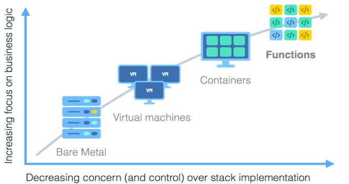
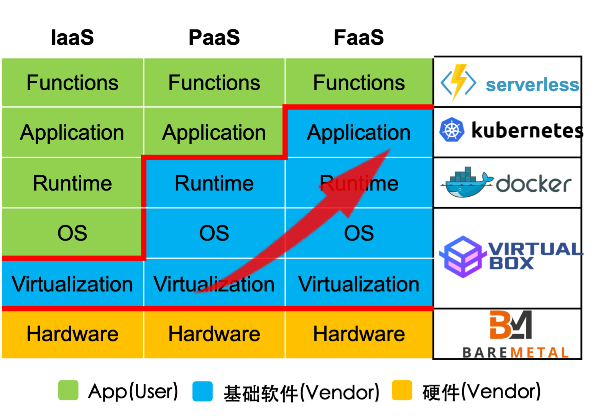

# 云计算

云计算的趋势开始于 1980 年代末期的网格计算（Grid Computing），当时计算机系统的计算能力较弱，对于一些科学计算问题，需要通过网络将大量的 计算机连接在一起协同工作才能满足需求。网格计算提供了虚拟的计算资源池，与云计算中数据中心概念非常相似。不同的是，云计算资源池是为多个用户提供服务，而网格计算的资源池一般只服务于单一特定应用。

2000 年代末云计算的概念才刚刚出现在学术界和产业界的视野中，被加州大学伯克利分校 David Patterson 科研团队预测为一个即将实现的古老神话。在这短短的十年时间里，云计算推动了基础硬件、操作系统、编程语言、应用软件、 网络乃至信息领域全链路一次又一次的变革和进步。同时也成为谷歌（Google）、 亚马逊（Amazon）、阿里巴巴（Alibaba）、微软（Microsoft）、腾讯（Tencent）、百度（Baidu）等互联网科技巨头的重要技术研究方向。

在早期实践中，应用程序独立运行在不同的服务器中 。购买和维护大量计算机需要高昂的成本，而计算资源却经常没能得到充分利用。虚拟化技术的出现解决了这一难题，将大量服务整合到同一服务器上，从而大大降低成本并提高了可管理性。本实验前面使用到虚拟机就是早起的虚拟化软件，在服务器上可以模拟出一个完整的计算机硬环境。但是，基于硬件模拟的虚拟化技术存在开销大、使用复杂等诸多不足之处，因此出现了轻量级虚拟化技术试图解决这些问题。

容器技术是轻量级虚拟化的代表之一：面向类 Unix 服务器的进程打包技术和命名空间虚拟化。在诸如Docker等分发工具的帮助下，使开发人员能够轻松部署新服务， 不用担心传统虚拟机中存在的低效率和高开销问题。

随着云平台的不断发展，公有云提供的服务经历了以虚拟机（Virtual Machine）为粒度的资源出租，和以容器（Container）为粒度的轻量级资源出租两大阶段。如今随着数据中心及其内部软件平台的快速创新，以及运维开发人员和用户对更加高效和便捷服务管理模式的追求。一种新的云计算服务模式Serverless Computing（简称为 Serverless）应运而生，改变了当前可伸缩应用程序的架构。应用程序从传统的服务器/容器的集合，转变为函数集合，即函数粒度 的弹性服务资源整合。

在后续试验中，会分别介绍上面提到的这些云计算技术。

让我们从[sec01_Docker](sec01_Docker.md)开始。