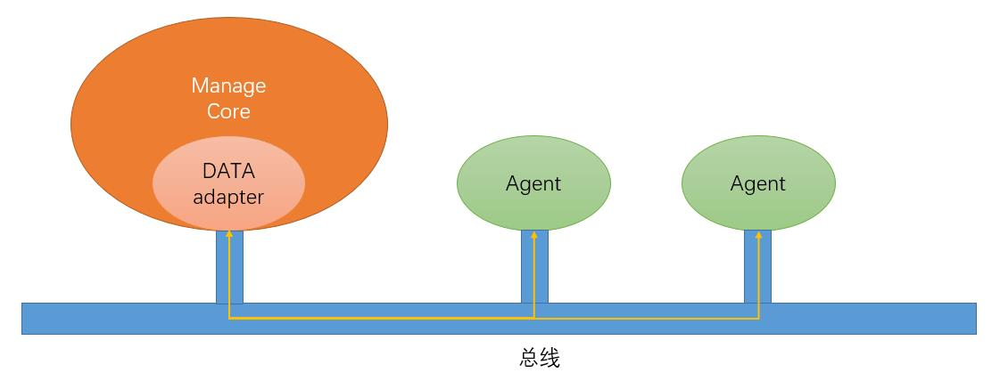

# 总线

By 杜翰霖

## 总线介绍

总线是信息高铁中的通信模块，独立于信息高铁gluenet核心代码运行。总线由一台总线服务器和相应的client构成，每个使用总线进行消息收发的发送者/接收者都需要通过一个client上的接口向对应的总线服务器发起发/收请求。在信息高铁系统中，总线client的接口由gluenet的data adapter模块进行封装。

总线的核心逻辑由 **Nats** 消息中间件实现。

总线的两个主要功能为：以特定的主题收发消息，向特定的工作单元发送RPC请求。

- 收发消息

    收发消息基于Pub-Sub模型。发送者和接收者事前共同确定一个主题，即Subject。总线的消息传输基于该Subject完成。发送者在该Subject上发送一条消息到总线服务器，接收者在该Subject上接收被发出的消息。可以有多个Client发送同一个Subject下的消息，也可以有多个Client接收同一条消息。Subject可以重复使用。

- RPC请求

    RPC(Remote Procedure Call, 远程过程调用)请求基于Request-Respond模型。Request指令在指定的Subject上发送消息并等待回复，Respond方法在收到消息后向发送者发送回复信息。
    
    RPC发送者通过包装后的Request请求向工作单元注册一个远程方法，并向其传递参数。工作单元收到RPC注册请求后，启动对应的方法，并在执行结束后获取返回值，用Responde将其回复给发送者。发送者接收回复值。