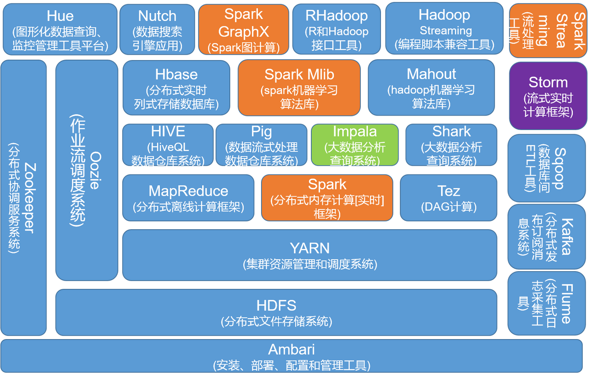

# 分布式计算框架

## 介绍

首先，为构建分布式应用，根据应用逻辑、数据使用、辅助功能、生产测试四层环节的需求，应考虑的因素如下：

1. 分布式系统架构设计
2. 数据一致性和可靠性
3. 服务发现与负载均衡
4. 安全性与隐私，部署和运维
5. 分布式追踪和监控

目前构建分布式应用的框架和对应以上每一功能的组件都有很多，按类别主要分为微服务及服务网格框架、集群管理框架、数据存储系统、通信框架及消息中间件、流处理与分布式计算引擎、辅助组件。按类别将常见产品整理如下：

- 微服务及服务网格辅助组件集合：
    - 微服务框架：Spring Cloud, Apache Dubbo
    - 服务网格框架：Istio, Linkerd
- 集群管理框架：Kubernetes, Apache ZooKeeper, Helix
- 数据存储系统：Apache Druid, Kudu, Pinot
- 通信框架及消息中间件：
    - Apache: Thrift, RocketMQ, Pulsar
    - 其他：ZeroMQ, RabbitMQ, NATS, Envoy
- 流处理与分布式计算引擎：
    - Apache: Kafka, Hadoop, Storm, Flink, Spark, Accumulo, Apex
    - 其他：Dask, Ray, Tensorflow

Apache的分布式组件库可整理如下：

## 任务

针对流处理与分布式计算引擎进行更为细致的实践，在Apache Kafka, Hadoop, Spark, Flink和Ray中任选一种，完成任务：

| 框架   | 学习内容                                                                                                                        | 实践内容                                                                                                       |
| ------ | ------------------------------------------------------------------------------------------------------------------------------- | -------------------------------------------------------------------------------------------------------------- |
| Hadoop | 分布式计算框架，分为HDFS和MapReduce两大部分，可以拆成两部分，[官方文档](https://hadoop.apache.org/docs/stable/index.html)较详实 | [一些小程序](https://github.com/Coursal/Hadoop-Examples/tree/main)                                             |
| Spark  | RDD, Streaming, DataFrames, SQL是几大重要部分，根据[官方文档学习](https://spark.apache.org/docs/latest/)                        | 请实践并理解[这个仓库](https://github.com/rich-iannone/so-many-pyspark-examples/tree/main)                     |
| Kafka  | 分布式流媒体平台，核心是**topic**，需要查阅资料理解全新的设计思路                                                               | [官方Quick Start](https://kafka.apache.org/quickstart)                                                         |
| Flink  | 数据流有状态计算，阅读[官方文档](https://nightlies.apache.org/flink/flink-docs-release-1.17/zh/)实践练习与概念透析              | [官方训练实例](https://github.com/apache/flink-training)                                                       |
| Ray    | 主要用于强化学习的分布式计算框架，阅读[官方文档](https://docs.ray.io/en/latest/)                                                | 在[官方文档](https://docs.ray.io/en/latest/)首页Scaling with Ray中有6个例子，点击右边Open in colab可以进行学习 | 
