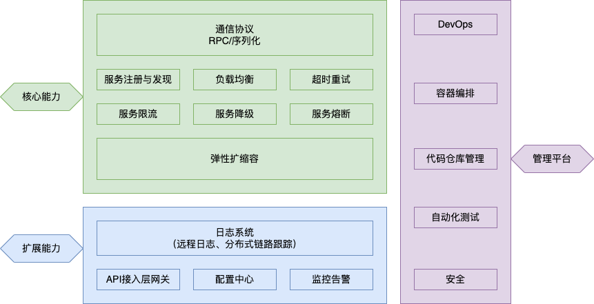

# 微服务框架

这一部分接续[第三章介绍的内容](sec03_Multi-APP.md)

## 介绍

根据微服务架构在生产环境下的要求，传统意义上大多数电商与互联网应用所使用的微服务框架需要包含以下能力: 

现有的绝大多数框架都支持以上很多能力，Spring Cloud与Apache Dubbo为使用最为广泛的微服务治理开源框架，支撑了很大一部分应用从单体应用上云的转变。近年来，云原生的开源社区不断壮大，针对不同的微服务能力，有众多的开源工具提供支持，能够根据需要以及工具特性进行组合: 

- 服务注册发现: ZooKeeper, Eureka, Consul, Nacos 
- 服务配置: Spring Cloud Config, Archaius  
- 服务熔断: Hystrix, Resilience4j
- 网关: Zuul, Spring Cloud Gateway  
- 负载均衡: Ribbon, Feign  
- 追踪工具: Zipkin, Sleuth  
- 日志采集: ElasticSearch, Logback  
- 监控平台: Prometheus, Grafana, Spring boot admin

以Spring Cloud框架为例，可以以官方框架为基础，融合不同微服务支撑技术后形成了一系列对生产实践支持更全面的框架，其中以Alibaba中间件团队开发的的开源框架Spring Boot Alibaba支持最为全面：

主要云服务厂商都针对客户需求对框架的完整性做了很大优化，能够满足开发迭代与生产应用并行的微服务开发环境，以容错与即时恢复处理来保证全时段高可用性。

## 任务

请查阅资料了解上述各个分布式能力的作用，浅了解背后的原理，找出对应的源码实现。

因为两种主流的微服务框架都是用Java语言编写的，因此你需要对Java和面向对象编程有初步的了解。

以下两个任务可以从中选择一个来做：

1. 阅读并实践[Spring Cloud构建微服务架构Dalston版](https://blog.didispace.com/spring-cloud-learning/)
2. [跟随实例任务学习Apache Dubbo](https://cn.dubbo.apache.org/zh-cn/overview/tasks/)

注意在实践过程中要尝试去理解相关组件的设计用途。

如果你想进一步探索，可以尝试用上面介绍的各个功能组件替换掉Spring Cloud相关组件，并且进行比较。