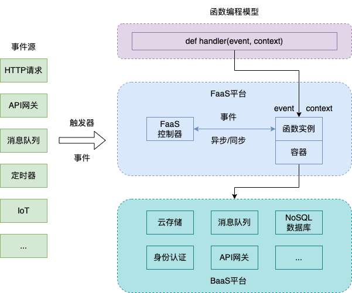

# 无服务器计算框架

## 介绍

基于已经成熟的微服务、分布式框架与算法，为方便用户专注于开发业务逻辑而无需在意资源管理，Serverless框架应运而生，以使用方便、自动化资源扩展、高可靠性等优势快速吸引了企业应用与学术研究。

Serverless计算描述了一种更细粒度的部署模型运行用户代码，运行所需资源由服务提供商实现弹性伸缩而非用户提前申请。用户根据代码实际运行消耗的资源量缴费，无需预租一定量的服务器使得在资源空闲时产生浪费。[伯克利关于Serverless的论文](https://www2.eecs.berkeley.edu/Pubs/TechRpts/2019/EECS-2019-3.pdf)中指出，Serverless与Serverful的三个关键区别如下：

- 计算与存储解耦；
- 执行代码而不管理资源分配；
- 按资源使用比例支付，而不是按资源分配比例支付。

请阅读上述最著名的Serverless早期指引，并且适当地提纲挈领。

Serverless的其他特点有以下几个方面：

1. 快速部署：Serverless应用程序可以在几秒钟内部署到云服务提供商的平台上，并且可以通过API网关和事件触发器快速响应请求，提高应用程序的响应速度和性能。
2. 自动扩缩容：Serverless架构能够自动根据应用程序的实际负载情况进行弹性扩缩容，无需手动调整，从而保证应用程序的高可用性和可伸缩性。
3.  无状态：Serverless架构模式下，应用程序应该是无状态的，每次请求都是独立的，不会对其他请求产生影响，这样可以提高应用程序的可靠性和安全性。

Serverless平台通常提供两种服务：Backend-as-a-Service(以下简称BaaS)，即基于API的第三方云服务，可替代程序中的核心功能子集，比如文件数据存储、消息推送、身份验证等；Function-as-a-Service(以下简称FaaS)，提供事件驱动计算，函数运行所需资源的调配由平台负责。FaaS平台与BaaS能力共同构成了Serverless，其架构模型可概述如下图所示：

为后期过渡至Serverless框架以向用户提供简单编程接口，我们调研了开源的Serverless框架，根据EDA应用的特征确立了一些对Serverless框架需求的特性，我们整理了这些开源框架的支持性如下：

| Serverless框架 | 状态存储方式         | 资源扩缩能力                       | 并行与并发处理                       | 微服务框架                   |
| -------------- | -------------------- | ---------------------------------- | ------------------------------------ | ---------------------------- |
| OpenWhisk      | 保存在couchDB中      | Load Balancer全局自动扩缩          | 支持容器级并行                       | 通过REST API部署微服务       |
| Kubeless       | 状态由k8s管理        | 基于HPA自动扩缩                    | 支持，基于k8s的处理                  | 基于k8s进行函数级封装        |
| Knative        | 无状态，依赖外部存储 | 支持，通过KPA实现                  | 支持，基于并发请求数确定Pod数量      | 通过CRD部署                  |
| Fission        | 无状态，依赖外部存储 | 自动扩展，支持预测性或自定规则扩缩 | 支持，基于k8s与Serverless实现        | 基于k8s进行函数级封装        |
| OpenFaaS       | 无状态，依赖外部存储 | 支持，通过监控指标自动触发         | 支持，根据流量和压力调整函数副本数量 | 基于Serverless进行函数级封装 |
| Lambda         | 无状态，依赖外部存储 | 自动扩展，实现精细化控制           | 实现容器级并发与异步支持             | 使用AWS其他套件支持          |
| Functions      | Azure其他产品提供    | 支持垂直、水平自动扩缩             | 支持并行、并发与异步                 | 支持垂直、水平自动扩缩       |

## 任务

首先请阅读OpenWhisk[这一篇blog](https://medium.com/openwhisk/uncovering-the-magic-how-serverless-platforms-really-work-3cb127b05f71)，了解Serverless平台如何完成事件驱动程序。进阶可以阅读[如何提升平台性能的blog](https://medium.com/openwhisk/squeezing-the-milliseconds-how-to-make-serverless-platforms-blazing-fast-aea0e9951bd0)。

在对Serverless框架进行学习时一定要抓住前面描述的几个特点，思考它们是如何实现快速部署运行、自动扩缩容、处理状态的，在学习文档中应有所体现。

在上述Serverless框架中任选一种完成学习任务：

| Serverless框架 | 学习任务                                                                                                                                                                       | 工程任务                                                                                  | 补充任务                                                                                                                                                |
| -------------- | ------------------------------------------------------------------------------------------------------------------------------------------------------------------------------ | ----------------------------------------------------------------------------------------- | ------------------------------------------------------------------------------------------------------------------------------------------------------- |
| OpenWhisk      | 学习与阅读[官方文档](https://openwhisk.apache.org/documentation.html)，有对其核心概念Action, Trigger和Rule的阐释                                                               | 完成教程中OpenWhisk的部署和实验                                                           | 参照[一个示例仓库](https://github.com/marcusleg/openwhisk-examples)进行多个实例的实践                                                                   |
| KNative        | 学习[官方文档](https://knative.dev/docs/getting-started/)，熟悉Function, Service和Event的概念，可参考[其他资料](https://knative-sample.com/10-getting-started/10-why-knative/) | 完成KNative的部署，实践三个概念的实例                                                     | 官方提供了详实的[Code Samples](https://knative.dev/docs/samples/serving/)，可进行多个实例的实践                                                         |
| Fission        | 阅读[官方文档](https://fission.io/docs/)Architecture和Concepts部分，熟悉相关概念                                                                                               | 遵照[官方文档](https://fission.io/docs/)Installation完成Fission的部署，根据Usage完成实践  | 官方提供了[其他的实例](https://github.com/fission/examples)可以进行学习                                                                                 |
| OpenFaaS       | 参照[官方文档](https://docs.openfaas.com)阅读Design & Architecture一节，参考[这一篇博客](https://atbug.com/openfaas-case-study-zh/)辅助理解                                    | 按照[官方文档](https://docs.openfaas.com)中Getting Started完成部署，按照Tutorials完成实践 | 配合[这篇博客](https://blog.alexellis.io/openfaas-storage-for-your-functions/)，完成一个[小项目](https://github.com/alexellis/function-storage-example) | 

因为VMWare的Kubeless已Archive不再支持维护，所以不作为任务，剩下两个框架Lambda和Functions都属于商业工具，不方便利用开源组件部署，所以不作为任务。